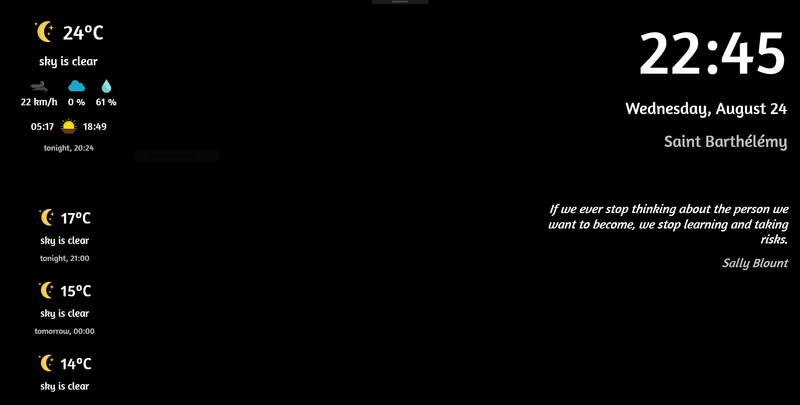

# smart-mirror

This __Smart Mirror App__ application runs on the Universal Windows Platform, UWP.

## Supported Features

At the current stage of development the following capabilities are present:

- 24-hour formatted clock and day
- quote of the day
- ephemeris, or Saint of the Day (France specific)
- weather, both current and forecast.

## Configuring the App

To configure the app, edit the `settings.json` file under the app project.
You need to request a free API key at http://openweathermap.org/api to fetch weather data. This goes to the `weather.key` field.
Then provide your location with the `weather.city` and `weather.country` fields.

## Using the App

Build the App with Visual Studio and deploy it to your local machine or Raspberry Pi 2 or 3!
